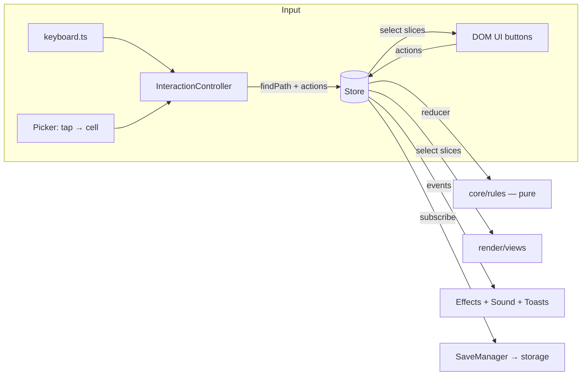

# Architecture

Tiny Isle is split into layers with one-way dependencies. Pure game logic sits at the centre and knows nothing about the screen; everything visual reacts to state.

## Layers

| Layer         | Folder                   | May import   | Notes                                                                    |
| ------------- | ------------------------ | ------------ | ------------------------------------------------------------------------ |
| Domain        | `src/core`               | nothing else | Types, content config, rules, world layout, pathfinding, RNG. 100% pure. |
| State         | `src/state`              | core         | Actions, reducer, store, selectors.                                      |
| Persistence   | `src/persistence`        | core, state  | Serialise, validate, migrate, autosave.                                  |
| Rendering     | `src/render`             | core, state  | Babylon.js. Builders make models; views keep them in sync with state.    |
| UI            | `src/ui`                 | core, state  | Plain DOM components; each subscribes to the slices it shows.            |
| Input / audio | `src/input`, `src/audio` | core         | Pure mappings plus thin browser bindings.                                |
| App           | `src/app`                | everything   | `createGame` is the composition root that wires the layers.              |

`src/main.ts` only checks WebGL support, creates the Babylon `Engine`, calls `createGame`, and starts the render loop.

## Data flow for one click

1. `Picker` turns a tap on the canvas into a grid `Cell` (drags that orbit the camera are ignored).
2. `InteractionController.clickCell` cancels any walk in progress, runs A* (`core/pathfinding`) and asks the `Mover` (`PlayerView`) to walk the path. Each step dispatches `player/move`.
3. On arrival it dispatches `tile/use`. The reducer calls `core/rules/farming.useTool`, which returns `{ state, events }`.
4. The store swaps in the new state, notifies `select` subscribers whose slice changed, then broadcasts events.
5. `PlotView` rebuilds the one tile whose object changed; `Effects` bursts particles; the sound engine plays a note; `Toasts` shows a message if needed; `SaveManager` schedules a debounced save.

## Why these choices

- **Pure core + reducer**: every rule is a function you can unit test in milliseconds with no browser. See [ADR 0002](adr/0002-pure-core-and-store.md).
- **Immutable state with structural sharing**: views detect change with `===`, so updates are O(changed) rather than O(everything).
- **Events alongside state**: effects that aren't state (sounds, particles, toasts) react to explicit events instead of diffing.
- **World layout as data** (`core/world.ts`): the renderer and pathfinding read the same map, so what you see is where you can walk.
- **Deep Babylon imports** via `render/babylon.ts`: only the engine parts we use are bundled, and required side-effect modules are registered in one place. See [ADR 0001](adr/0001-babylonjs.md).
- **DOM for UI**: crisp text, accessibility and CSS theming for free; Babylon GUI is reserved for in-world markers.

## Performance notes

- Materials are cached per colour and shared (`SceneContext.material`).
- Fence posts, path stones and flowers are GPU instances.
- Shadows and glow are disabled on small screens (`quality: 'low'`).
- Per-frame work is limited to small `onBeforeRender` loops (bobbing, butterflies, rain) and the tween runner.
- Babylon is split into its own long-cached chunk.
